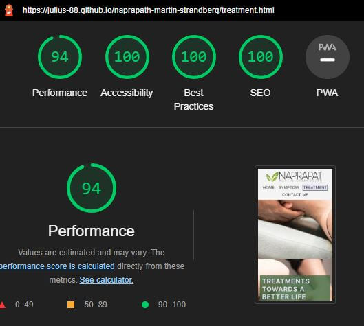

# Naprapath Martin Strandberg

- Naprapath Martin Strandberg has created a business whose aim is to treat, educate and help prevent injuries to all people so that they can live a healthier life. 

- The goal of this website is to attract a younger generation of people while 
    being accessible to everyone.
    
- They will be able to find information about their particular injury, the treatments offered, and general information about the business and be able to book a session or contact the owner.

## Existing Features

- Navigation Bar
    - Featured on top of the website is the navigation bar. On the left corner, the viewer can see the company name and logo and on the right corner, they can see the various pages available.
    - Clicking on the company name and logo will bring them back to the landing page.
    - On the right side they can see which page they are on by it having a different background color, border, and bigger padding.
    - Hovering over the website pages will make them bigger and create a similar effect as the active page they are on.
    - The navigation bar is displayed and makes the different sections easy to find. It is available on each page.

## The Header Section

- The hero image
    - It has a zoom-in animation to catch the eye of the viewer.
    - It displays text related to the page they are on.
    - It contains a button that allows the viewer to book a session. Upon hovering it will change color to a darker green.
    - It contains a number to the owner the viewer can call to ask questions or to book a session. Upon hovering it will turn green and get an underline.
    - This section tells the user which page they are on and allows them to quickly book a session.

### Hero Image on the Landing page

### Hero Image on Symptom page

### Hero Image on the Treatment page

### Hero Image on the Contact page

## Landing Page

### About Me Section

- Introduces the viewer to the owner Martin Strandberg. They are given some information about him. This creates a familiarity with him and shows that he can be trusted since he has been in the business for a long time.

- There is also a button that allows the viewer to book a session. Upon hovering it will change color to a darker green.

### Partner Section

- Showcases all the logos of the different companies he has a working relationship with. Re-establishing his expertise by having so many companies working with him. Thereby reinforcing trust with the viewer that he knows what he is doing.

### Symptom Section

- Informs the viewer of the common misconception of how injuries develop and how he will go about treating them. This gives the viewer a general idea of how he works and what to expect. And reinforces a level of trust.

- There is also a button that will take the viewer to the symptoms page, where they can learn more about their symptom. The button upon hovering will turn a darker shade of green.

## The Footer Section

- The footer holds all important general information for the user about the company.

- It shows the opening hours, the contact information, and the address for visiting. 

- It also holds a button that takes the user to the contact page where they can ask a question. Upon hovering on the button it will turn a darker shade of green.

- Upon hovering on the email address and the phone number they will turn, light green, and get an underline.

- Email link
    - If clicked on will open the viewer's email provider so that they can send a message to the owner.

- Phone link
    - If clicked upon will prompt you to call the owner.

- It also informs that the page is copyrighted and who has created it. The footer section is available on every page.

## Symptom Page

- Contains information about the various symptoms people have, what the signs are and how the body reacts. Upon clicking on each title a descriptive text will appear underneath it.

- This lets the user understand more about their situation. Thereby being able to properly talk about their problem to the owner.

- It also contains small information about the first visit at the end of the page. So the viewer knows what to expect.

## Treatment Page

- In a similar style to the symptom page, it provides information about which treatment options he offers and what ailments they are used upon. 

- It allows the viewer to know what they should expect during the treatments and what he is capable of.

## Contact Page

- Provides the user with a way to send a query to the owner. They will have to provide their full name, email address, and phone number. 

- The send button turns a dark green upon hovering. 

- Upon completion, the user will be taken to a customized response page. Where they will be informed that this is not a real form but how they can get into contact with the owner. 

- It contains his email address, phone number, the book button, and a return to landing page button. Each will react the same way as previously stated while hovering.

## Additional Features & Ideas to Implement

- I was considering adding a book button at the end of the symptom and treatment page to allow the viewer to have an easier time booking sessions. 

- I was considering changing the information section of the symptom and treatment page to be in the shape of cards and stand side by side instead of underneath each other. I think this will provide a better user experience. 

- Add the owner's social media accounts in the footer section.

## Testing

- Responsivity was tested through DevTools on Google Chrome.
    - For the mobile version flex-direction column was used to make it easier to read.
- I have confirmed that it works on Google Chrome, Firefox, and android phone.
- The form has been tested and requires entries in every field.

### Validator Testing

- HTML Validation was tested through [W3C](https://validator.w3.org/)
    - During my initial test it would seem I had combined a link and a button. This has been fixed. Here is a picture of the Error,
    - Upon testing the landing page I received this Error, it has been resolved now. I should have used h2 instead of figcaption.
    - Upon third testing, no errors were returned.
        - testing landing page 
        - testing symptom page 
        - testing treatment page 
        - testing contact page 
        - testing form response page 
- CSS Validation was tested through [W3C](https://jigsaw.w3.org/css-validator/#validate_by_input)
    - One error was returned and has been fixed. 
    - Upon a second testing. no errors were returned  

    

- Accessibility was tested through Lighthouse in dev tools. 
    - Validation for landing page mobile 
    - Validation for landing page desktop 
    - Validation for symptom page mobile 
    - Validation for symptom page desktop 
    - Validation for treatment page mobile 
    - Validation for treatment page desktop 
    - Validation for contact page mobile 
    - Validation for contact page desktop 
    - Validation for response page mobile 
    - Validation for response page desktop 

## Unfixed Bugs

- No unfixed bugs

## Deployment

- GitHub was used to deploy the site [Naprapath Martin Strandberg](https://julius-88.github.io/naprapath-martin-strandberg/)

1. In the GitHub repository go to *the Settings* tab.
2. On the left side under *code and automation* click on *pages*.
3. In the middle of the page under *GitHub Pages* there is a section called *Branch*.
Under the *Branch* title there is a button called *None*.
4. Click on the *None* button and choose *main* and then click on the button next to it called *Save*

The website will now be deployed in a couple of minutes. 

## Credit

### Content
- The original website that the owner has is this: [Martin Strandberg](http://www.naprapatmartinstrandberg.se/)
    - Since the idea was to create a new website for him, I used some of his text as a base and altered them. I used what information he had given about his treatments and filled out the rest using Wikipedia and my own custom text.

- I used a code-along project we did with Code Institute as a base reference point to structure the code.
    - It is called [Love Running](https://github.com/Code-Institute-Solutions/love-running-2.0-sourcecode)
    - The animation effect on the hero image was taken from this project.

- I used a real site for inspiration for the design of the website. [naprapatklinik018](https://naprapatklinik018.se/)

I have used a combination of [MDN Web Docs](https://developer.mozilla.org/en-US/), [W3schools](https://www.w3schools.com/) and [Code Institute's](https://codeinstitute.net/se/) learning program to learn about various code and how they should be implemented.

### Media

- All pictures were taken from the owner's [Facebook Page](https://www.facebook.com/people/Naprapat-Nordic-Wellness-%C3%85kersberga/100063561190738/) and [Pexels](https://www.pexels.com/sv-se/) and modified with [I Love IMG](https://www.iloveimg.com/)
